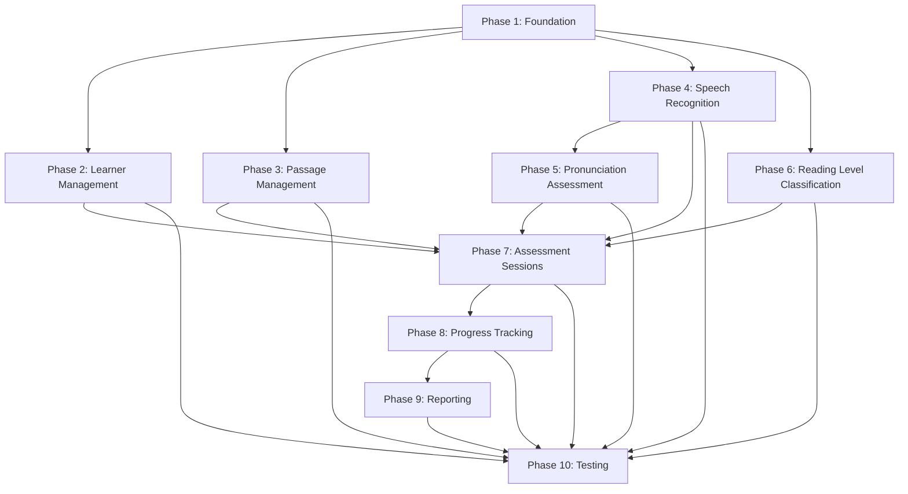

# Design Document: Development Phases Framework

## Overview

The Development Phases Framework provides a structured, narrative sequential methodology for implementing a comprehensive Android-based reading assessment mobile application. This framework organizes development into ten distinct phases, each with specific technical objectives, deliverables, and measurable outcomes suitable for thesis and capstone project documentation.

The framework addresses the complexity of integrating multiple advanced technologies—Firebase cloud services, Vosk offline speech recognition, MFCC acoustic analysis, Random Forest machine learning, and DistilBERT natural language processing—into a cohesive educational assessment platform. By establishing clear phase boundaries and dependencies, the framework enables systematic development while maintaining academic rigor appropriate for graduate-level research documentation.

The design emphasizes offline-first architecture to ensure functionality in resource-constrained educational environments, role-based access control to protect learner data privacy, and Phil-IRI compliance to align with established reading assessment protocols.

## Architecture

### System Architecture Overview

The Reading Assessment System follows a layered architecture pattern with clear separation of concerns:

```
┌─────────────────────────────────────────────────────────────┐
│                    Presentation Layer                        │
│  (Activities, Fragments, Adapters, Dialogs)                 │
└─────────────────────────────────────────────────────────────┘
                            │
┌─────────────────────────────────────────────────────────────┐
│                    Business Logic Layer                      │
│  (Repositories, Validators, Session Managers)               │
└─────────────────────────────────────────────────────────────┘
                            │
┌─────────────────────────────────────────────────────────────┐
│                    ML/AI Processing Layer                    │
│  (Speech Recognition, Pronunciation Scoring, Text Analysis) │
└─────────────────────────────────────────────────────────────┘
                            │
┌─────────────────────────────────────────────────────────────┐
│                    Data Persistence Layer                    │
│  (Firebase Realtime Database, Local Cache, Model Storage)   │
└─────────────────────────────────────────────────────────────┘
```

### Phase Dependency Graph



### Technology Stack by Phase

| Phase | Core Technologies | Libraries/Frameworks |
|-------|------------------|---------------------|
| 1 | Firebase Auth, Firebase Realtime DB | Android SDK, Firebase SDK |
| 2 | Firebase Realtime DB | RecyclerView, Material Design |
| 3 | Firebase Realtime DB | RecyclerView, Material Design |
| 4 | Vosk, MFCC | Vosk Android, TarsosDSP |
| 5 | Random Forest, MFCC | Smile ML, TarsosDSP |
| 6 | DistilBERT | TensorFlow Lite, Hugging Face |
| 7 | Integration of 2-6 | Android MediaRecorder |
| 8 | Statistical Analysis | MPAndroidChart |
| 9 | Reporting & Export | PDF generation libraries |
| 10 | Testing Frameworks | JUnit, Espresso, Mockito |

## Components and Interfaces

### Phase 1: Foundation and Core Infrastructure

**Components:**

1. **AuthenticationManager**
   - Manages Firebase Authentication lifecycle
   - Handles user registration, login, logout
   - Maintains authentication state

2. **RoleManager**
   - Assigns and validates user roles (educator/guardian)
   - Enforces role-based access control
   - Stores role metadata in Firebase

3. **DatabaseManager**
   - Configures Firebase Realtime Database
   - Enables offline persistence
   - Manages database references

4. **NavigationController**
   - Routes users based on authentication state and role
   - Manages Activity transitions
   - Implements back stack management

**Interfaces:**

```java
interface AuthenticationManager {
    void registerUser(String email, String password, UserRole role, AuthCallback callback);
    void loginUser(String email, String password, AuthCallback callback);
    void logoutUser();
    User getCurrentUser();
    boolean isAuthenticated();
}

interface RoleManager {
    void assignRole(String userId, UserRole role);
    UserRole getUserRole(String userId);
    boolean hasPermission(String userId, Permission permission);
}

interface DatabaseManager {
    DatabaseReference getReference(String path);
    void enableOfflinePersistence();
    void setSecurityRules(SecurityRules rules);
}
```

**Database Schema (Phase 1):**

```
/users
  /{userId}
    - email: String
    - role: String ("educator" | "guardian")
    - createdAt: Long
    - displayName: String
```

### Phase 2: Learner Management System

**Components:**

1. **LearnerRepository**
   - CRUD operations for learner profiles
   - Firebase synchronization
   - Offline data caching

2. **LearnerAdapter**
   - RecyclerView adapter for learner list
   - Handles item click events
   - Displays learner metadata

3. **LearnerSearchFilter**
   - Filters learners by name, grade, section
   - Implements search algorithm
   - Updates UI in real-time

**Data Model:**

```java
class Learner {
    String id;
    String name;
    int gradeLevel;
    String section;
    String educatorId;
    long createdAt;
    long updatedAt;
    Map<String, Object> metadata;
}
```

**Interfaces:**

```java
interface LearnerRepository {
    void createLearner(Learner learner, RepositoryCallback<Learner> callback);
    void getLearner(String learnerId, RepositoryCallback<Learner> callback);
    void updateLearner(Learner learner, RepositoryCallback<Learner> callback);
    void deleteLearner(String learnerId, RepositoryCallback<Void> callback);
    void getLearnersForEducator(String educatorId, RepositoryCallback<List<Learner>> callback);
}
```

**Database Schema (Phase 2):**

```
/learners
  /{learnerId}
    - name: String
    - gradeLevel: Number
    - section: String
    - educatorId: String
    - createdAt: Long
    - updatedAt: Long
```

### Phase 3: Reading Material Management

**Components:**

1. **PassageRepository**
   - CRUD operations for reading passages
   - Difficulty level categorization
   - Content validation

2. **PassageAdapter**
   - RecyclerView adapter for passage list
   - Displays passage metadata
   - Handles edit/delete actions

3. **PassageValidator**
   - Validates passage content
   - Ensures non-empty text
   - Checks difficulty level assignment

**Data Model:**

```java
class Passage {
    String id;
    String title;
    String content;
    DifficultyLevel difficultyLevel;
    int wordCount;
    long createdAt;
    String createdBy;
}

enum DifficultyLevel {
    PREPRIMER, PRIMER, GRADE_1, GRADE_2, GRADE_3, 
    GRADE_4, GRADE_5, GRADE_6
}
```

**Interfaces:**

```java
interface PassageRepository {
    void createPassage(Passage passage, RepositoryCallback<Passage> callback);
    void getPassage(String passageId, RepositoryCallback<Passage> callback);
    void updatePassage(Passage passage, RepositoryCallback<Passage> callback);
    void deletePassage(String passageId, RepositoryCallback<Void> callback);
    void getPassagesByDifficulty(DifficultyLevel level, RepositoryCallback<List<Passage>> callback);
}

interface PassageValidator {
    ValidationResult validateContent(String content);
    ValidationResult validateDifficultyLevel(DifficultyLevel level, String content);
}
```

**Database Schema (Phase 3):**

```
/passages
  /{passageId}
    - title: String
    - content: String
    - difficultyLevel: String
    - wordCount: Number
    - createdAt: Long
    - createdBy: String
```

### Phase 4: Speech Recognition Engine

**Components:**

1. **VoskRecognizer**
   - Initializes Vosk speech recognition
   - Loads language model from assets
   - Processes audio streams

2. **MFCCExtractor**
   - Extracts Mel-Frequency Cepstral Coefficients
   - Applies windowing and FFT
   - Generates feature vectors

3. **AudioProcessor**
   - Captures microphone input
   - Applies noise reduction
   - Segments audio by word boundaries

4. **TranscriptionAccuracyCalculator**
   - Compares recognized text to expected text
   - Calculates word-level accuracy
   - Identifies mispronounced words

**Interfaces:**

```java
interface SpeechRecognizer {
    void initialize(String modelPath, RecognizerCallback callback);
    void startRecognition();
    void stopRecognition();
    void processAudio(byte[] audioData);
    String getTranscription();
}

interface MFCCExtractor {
    float[][] extractFeatures(byte[] audioData, int sampleRate);
    float[] extractFeaturesForWord(byte[] audioData, int startSample, int endSample);
}

interface TranscriptionAccuracyCalculator {
    AccuracyResult calculateAccuracy(String expected, String recognized);
    List<WordMatch> alignWords(String expected, String recognized);
}
```

**Data Models:**

```java
class TranscriptionResult {
    String recognizedText;
    List<WordSegment> wordSegments;
    float confidence;
    long processingTimeMs;
}

class WordSegment {
    String word;
    int startTimeMs;
    int endTimeMs;
    float confidence;
}

class AccuracyResult {
    float overallAccuracy;
    int correctWords;
    int totalWords;
    List<WordMatch> wordMatches;
}

class WordMatch {
    String expectedWord;
    String recognizedWord;
    boolean isCorrect;
    int position;
}
```

### Phase 5: Pronunciation Assessment

**Components:**

1. **PronunciationScorer**
   - Scores pronunciation quality using MFCC features
   - Applies Random Forest classification
   - Generates numerical scores (0-100)

2. **RandomForestModel**
   - Loads pre-trained Random Forest model
   - Performs feature classification
   - Returns probability distributions

3. **FeatureNormalizer**
   - Normalizes MFCC features
   - Applies z-score standardization
   - Handles feature scaling

4. **FeedbackGenerator**
   - Generates real-time pronunciation feedback
   - Categorizes pronunciation quality
   - Provides improvement suggestions

**Interfaces:**

```java
interface PronunciationScorer {
    void initialize(String modelPath);
    PronunciationScore scoreWord(float[] mfccFeatures, String expectedWord);
    PronunciationScore scoreSentence(List<float[]> wordFeatures, List<String> expectedWords);
}

interface RandomForestModel {
    void loadModel(String modelPath);
    float[] predict(float[] features);
    float getProbability(float[] features, int classIndex);
}

interface FeedbackGenerator {
    String generateFeedback(PronunciationScore score);
    PronunciationCategory categorize(float score);
}
```

**Data Models:**

```java
class PronunciationScore {
    String word;
    float score; // 0-100
    PronunciationCategory category;
    float[] mfccFeatures;
    String feedback;
}

enum PronunciationCategory {
    EXCELLENT(90, 100),
    GOOD(75, 89),
    FAIR(60, 74),
    NEEDS_IMPROVEMENT(0, 59);
    
    int minScore;
    int maxScore;
}
```

### Phase 6: Reading Level Classification

**Components:**

1. **DistilBERTAnalyzer**
   - Loads DistilBERT model (TensorFlow Lite)
   - Tokenizes input text
   - Generates text embeddings

2. **ReadingLevelClassifier**
   - Predicts reading difficulty level
   - Analyzes text complexity features
   - Maps predictions to grade levels

3. **TextComplexityAnalyzer**
   - Calculates readability metrics
   - Analyzes vocabulary complexity
   - Computes sentence structure complexity

**Interfaces:**

```java
interface TextAnalyzer {
    void initialize(String modelPath);
    float[] generateEmbeddings(String text);
    TextComplexityMetrics analyzeComplexity(String text);
}

interface ReadingLevelClassifier {
    DifficultyLevel predictLevel(String text);
    float[] getLevelProbabilities(String text);
    ReadingLevelPrediction predictWithConfidence(String text);
}
```

**Data Models:**

```java
class ReadingLevelPrediction {
    DifficultyLevel predictedLevel;
    float confidence;
    Map<DifficultyLevel, Float> levelProbabilities;
    TextComplexityMetrics complexityMetrics;
}

class TextComplexityMetrics {
    float averageWordLength;
    float averageSentenceLength;
    int uniqueWordCount;
    float lexicalDiversity;
    float fleschReadingEase;
}
```

### Phase 7: Assessment Session Management

**Components:**

1. **SessionManager**
   - Orchestrates assessment workflow
   - Coordinates speech recognition, pronunciation scoring
   - Manages session state

2. **WordHighlighter**
   - Highlights words in real-time during reading
   - Synchronizes with speech recognition
   - Provides visual feedback

3. **PhilIRITimer**
   - Implements Phil-IRI timing requirements
   - Tracks reading duration
   - Provides time-based alerts

4. **SessionDataCollector**
   - Aggregates all session metrics
   - Captures audio recordings
   - Prepares data for persistence

**Interfaces:**

```java
interface SessionManager {
    void startSession(String learnerId, String passageId);
    void pauseSession();
    void resumeSession();
    void endSession();
    SessionState getSessionState();
}

interface WordHighlighter {
    void highlightWord(int wordIndex);
    void clearHighlight();
    void setPassageText(String text);
}

interface PhilIRITimer {
    void startTimer();
    void stopTimer();
    long getElapsedTimeMs();
    boolean hasExceededTimeLimit();
}
```

**Data Models:**

```java
class AssessmentSession {
    String sessionId;
    String learnerId;
    String passageId;
    long startTime;
    long endTime;
    long durationMs;
    TranscriptionResult transcription;
    List<PronunciationScore> pronunciationScores;
    AccuracyResult accuracy;
    byte[] audioRecording;
    SessionStatus status;
}

enum SessionStatus {
    NOT_STARTED, IN_PROGRESS, PAUSED, COMPLETED, CANCELLED
}
```

**Database Schema (Phase 7):**

```
/sessions
  /{sessionId}
    - learnerId: String
    - passageId: String
    - startTime: Long
    - endTime: Long
    - durationMs: Long
    - transcription: String
    - accuracyPercentage: Number
    - averagePronunciationScore: Number
    - status: String
    - audioUrl: String (Firebase Storage reference)
```

### Phase 8: Progress Tracking and Analytics

**Components:**

1. **ProgressCalculator**
   - Computes aggregate statistics
   - Calculates averages and trends
   - Identifies performance patterns

2. **TrendAnalyzer**
   - Analyzes chronological session data
   - Detects improvement or decline
   - Generates trend predictions

3. **PerformanceVisualizer**
   - Creates charts and graphs
   - Displays progress over time
   - Highlights key metrics

**Interfaces:**

```java
interface ProgressCalculator {
    ProgressMetrics calculateProgress(String learnerId);
    ProgressMetrics calculateProgressForDateRange(String learnerId, long startDate, long endDate);
}

interface TrendAnalyzer {
    PerformanceTrend analyzeTrend(List<AssessmentSession> sessions);
    float predictNextScore(List<AssessmentSession> sessions);
}
```

**Data Models:**

```java
class ProgressMetrics {
    String learnerId;
    int totalSessions;
    float averageAccuracy;
    float averagePronunciationScore;
    long totalReadingTimeMs;
    PerformanceTrend trend;
    List<SessionSummary> recentSessions;
}

class PerformanceTrend {
    TrendDirection direction;
    float changeRate;
    float confidence;
}

enum TrendDirection {
    IMPROVING, STABLE, DECLINING
}

class SessionSummary {
    String sessionId;
    long date;
    float accuracy;
    float pronunciationScore;
    String passageTitle;
}
```

### Phase 9: Reporting System

**Components:**

1. **ReportGenerator**
   - Generates comprehensive reports
   - Formats data for display
   - Supports multiple report types

2. **RoleBasedDashboard**
   - Displays role-appropriate views
   - Filters data by user permissions
   - Implements guardian/educator dashboards

3. **ReportExporter**
   - Exports reports to PDF/CSV
   - Formats data for external use
   - Handles file generation and sharing

**Interfaces:**

```java
interface ReportGenerator {
    Report generateLearnerReport(String learnerId);
    Report generateSessionReport(String sessionId);
    Report generateProgressReport(String learnerId, long startDate, long endDate);
}

interface ReportExporter {
    File exportToPDF(Report report);
    File exportToCSV(Report report);
    void shareReport(File reportFile, ShareCallback callback);
}
```

**Data Models:**

```java
class Report {
    String reportId;
    ReportType type;
    String learnerId;
    long generatedAt;
    ProgressMetrics metrics;
    List<SessionSummary> sessions;
    Map<String, Object> additionalData;
}

enum ReportType {
    LEARNER_SUMMARY, SESSION_DETAIL, PROGRESS_OVER_TIME, COMPARATIVE_ANALYSIS
}
```

### Phase 10: Testing and Validation

**Testing Strategy:**

1. **Unit Testing**
   - Test individual components in isolation
   - Mock external dependencies (Firebase, ML models)
   - Verify business logic correctness

2. **Integration Testing**
   - Test component interactions
   - Verify data flow between layers
   - Test Firebase synchronization

3. **UI Testing**
   - Test user workflows with Espresso
   - Verify UI state changes
   - Test navigation flows

4. **Performance Testing**
   - Measure speech recognition latency
   - Test offline persistence performance
   - Verify memory usage

5. **Acceptance Testing**
   - Conduct user testing with educators
   - Validate Phil-IRI compliance
   - Verify accessibility requirements

## Data Models

### Complete Entity Relationship Diagram

```
User (1) ----< (M) Learner
Learner (1) ----< (M) AssessmentSession
Passage (1) ----< (M) AssessmentSession
AssessmentSession (1) ---- (1) TranscriptionResult
AssessmentSession (1) ----< (M) PronunciationScore
Learner (1) ---- (1) ProgressMetrics
```

### Firebase Database Structure (Complete)

```
/
├── users/
│   └── {userId}/
│       ├── email: String
│       ├── role: String
│       ├── displayName: String
│       └── createdAt: Long
│
├── learners/
│   └── {learnerId}/
│       ├── name: String
│       ├── gradeLevel: Number
│       ├── section: String
│       ├── educatorId: String
│       ├── createdAt: Long
│       └── updatedAt: Long
│
├── passages/
│   └── {passageId}/
│       ├── title: String
│       ├── content: String
│       ├── difficultyLevel: String
│       ├── wordCount: Number
│       ├── createdAt: Long
│       └── createdBy: String
│
├── sessions/
│   └── {sessionId}/
│       ├── learnerId: String
│       ├── passageId: String
│       ├── startTime: Long
│       ├── endTime: Long
│       ├── durationMs: Long
│       ├── transcription: String
│       ├── accuracyPercentage: Number
│       ├── averagePronunciationScore: Number
│       ├── status: String
│       └── audioUrl: String
│
└── progress/
    └── {learnerId}/
        ├── totalSessions: Number
        ├── averageAccuracy: Number
        ├── averagePronunciationScore: Number
        ├── totalReadingTimeMs: Number
        └── lastUpdated: Long
```

## Correctness Properties

*A property is a characteristic or behavior that should hold true across all valid executions of a system—essentially, a formal statement about what the system should do. Properties serve as the bridge between human-readable specifications and machine-verifiable correctness guarantees.*

